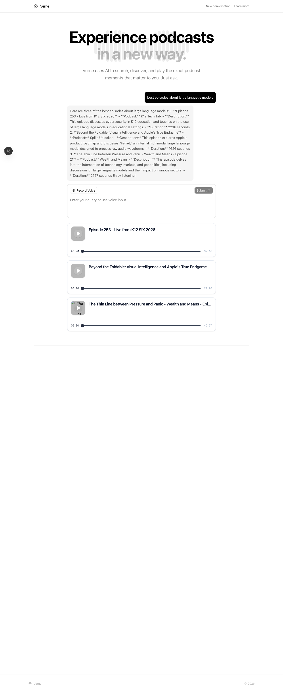

As we can see in `.playwright-mcp/` currently when the model responds, it can only respond with messages.

Instead we want:
1. the Vibe agent to have access to a tool called post_episode , which will make a HTTP request to the `/broadcast` endpoint, adhering to the episode schema.
2. all messages from Vibe (including thinking steps, and any other intermediate steps) to be sent to the frontend as messages, and

Get (1) working fully first then ask permission before moving on to (2).

## Implementation (1): `post_episode` tool

Completed. The agent now calls a native `post_episode` tool per episode, and the frontend renders them as playable podcast cards.

### What changed

| File | Change |
|------|--------|
| `packages/sandbox/tools/post_episode.py` | New `PostEpisode` BaseTool subclass. No-op that yields `success: true` — its purpose is to emit a structured `tool_call` event the backend intercepts. Args: `name`, `src`, `duration`, `cover_image`, `start_time`, `end_time`. |
| `backend/sandbox.ts` | Copies `post_episode.py` into `~/.vibe/tools/` inside the sandbox so Vibe auto-discovers it. Expanded `SandboxEvent` with `tool_name` and `args` fields. |
| `backend/server.ts` | Filters events for `post_episode` tool calls, extracts args, broadcasts as `"episodes"` event (with `podcasts` array). Falls back to `"message"` if no episodes found. |
| `packages/sandbox/prompts/podcast-agent.md` | Added field-mapping table and instructions for the agent to call `post_episode` per search result. |
| `frontend-v2/next.config.ts` | Added `rewrites()` to proxy `/api/*` to `localhost:3001` — was missing, so the Submit button never reached the backend. |

### Data flow

```
User submits query
  → frontend POST /api/query (proxied to backend :3001)
  → backend sends to sandbox agent
  → agent searches podcasts, calls post_episode per result
  → sandbox returns tool_call events with episode args
  → backend extracts episodes, broadcasts "episodes" via WebSocket
  → frontend renders FullPodcastCard components
```

### E2E verification

Playwright test (`test-post-episode.js`) submits "best episodes about large language models", waits for podcast cards to appear, and screenshots the result.


